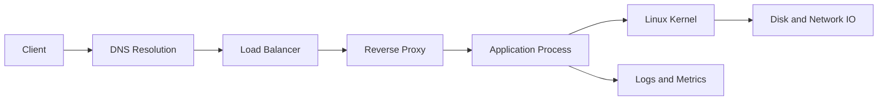

# Linux and Networking Foundations

[](../README.md)
[](../README.md)
[](../README.md)

This module builds Linux and networking depth from an infrastructure engineering perspective. The emphasis is operational behavior: how systems start, fail, recover, and respond under load. It is designed for long-term learning and reusable operational knowledge, not short-term certification prep.

## Repository Navigation

[](../README.md)
[](../02-docker-cicd/README.md)

## Table of Contents

- [Module Purpose](#module-purpose)
- [Module Index](#module-index)
- [Why Linux Matters in Infrastructure Engineering](#why-linux-matters-in-infrastructure-engineering)
- [Why Networking Is Foundational to Distributed Systems](#why-networking-is-foundational-to-distributed-systems)
- [Operational Importance of Linux Internals](#operational-importance-of-linux-internals)
- [Operational Focus Areas](#operational-focus-areas)
- [Production Operational Behavior](#production-operational-behavior)
- [Operational Mindset](#operational-mindset)
- [Learning Goals](#learning-goals)
- [Weekly and Day-wise Learning Structure](#weekly-and-day-wise-learning-structure)
- [Practical Experiments](#practical-experiments)
- [Failure and Debugging Philosophy](#failure-and-debugging-philosophy)
- [Commands Quick Reference](#commands-quick-reference)
- [Folder Structure Overview](#folder-structure-overview)
- [Progress Tracking](#progress-tracking)
- [Future Improvements](#future-improvements)

## Module Purpose

Linux and networking are the operational substrate of infrastructure. This module develops the ability to reason about system state, resource behavior, and network paths in production conditions. The goal is to understand why systems behave the way they do, not just how to configure them.

## Module Index

This index links to living artifacts as they are published.

| Artifact                     | Purpose                            | Status  |
| ---------------------------- | ---------------------------------- | ------- |
| [notes.md](notes.md)         | Operational notes and references   | Active  |
| [commands.md](commands.md)   | Curated commands with context      | Active  |
| [learnings.md](learnings.md) | Key insights and tradeoffs         | Active  |
| [mistakes.md](mistakes.md)   | Pitfalls and corrections           | Active  |
| [experiments/](experiments/) | Reproducible tests and results     | Active  |
| [diagrams/](diagrams/)       | Architecture and flow visuals      | Planned |
| [scripts/](scripts/)         | Diagnostics and automation helpers | Planned |

## Topics Covered

### Fundamentals

- Linux kernel and system architecture (kernel, shell, filesystem, processes, services)
- System components and their operational roles

### Filesystem

- Directory structure and purpose (`/`, `/home`, `/etc`, `/var`, `/tmp`, `/bin`, `/usr`, `/proc`, `/dev`)
- Basic filesystem commands and navigation

### Permissions & Ownership

- File permission model (symbolic and numeric notation)
- Permission types (read, write, execute) and their operational meaning
- User, group, and other permission levels
- File type indicators (regular file, directory, link)
- Ownership and chown operations
- Recursive permission changes

### Users & Groups

- User creation and lifecycle management
- Group operations and membership
- Sudo access and privilege escalation
- Home directory provisioning and shell configuration
- User verification and debugging

### Processes

- Process lifecycle and state transitions
- Running, background, and foreground processes
- Process inspection tools (ps, top, htop)
- Process termination (graceful and forced)
- Signal handling and lifecycle management

### System Services

- systemd architecture and PID 1
- Service lifecycle management (start, stop, restart, reload)
- Service boot behavior (enable, disable)
- Service logging with journalctl
- Service debugging and failure diagnosis
- Port binding and conflict resolution

## Recommended Learning Progression

```
Linux Basics
    ↓
Filesystem & Commands
    ↓
Permissions & Ownership
    ↓
Users & Groups
    ↓
Process Management
    ↓
System Services & systemd
    ↓
Logging & Debugging
    ↓
Networking Foundations
```

## Why Linux Matters in Infrastructure Engineering

- Linux is the runtime environment for most production systems.
- Every higher-level platform relies on kernel scheduling, memory management, and IO semantics.
- Operational issues usually surface as Linux-level symptoms first.

## Why Networking Is Foundational to Distributed Systems

- Distributed systems are defined by communication, not compute.
- Reliability depends on latency, timeouts, retries, and packet behavior.
- Understanding network paths explains most real-world failure modes.

## Operational Importance of Linux Internals

Linux internals shape reliability. Kernel scheduling, file descriptors, memory pressure, and IO queues directly influence service health. A strong mental model of these internals is required to diagnose performance regressions, capacity exhaustion, and cascading failures.

## Operational Focus Areas

| Area                  | Focus                                         | Operational relevance                    |
| --------------------- | --------------------------------------------- | ---------------------------------------- |
| Process management    | Scheduling, signals, limits, cgroups          | Service stability and resource isolation |
| System services       | systemd units, dependencies, restarts         | Predictable lifecycle control            |
| Logs                  | journald, syslog, rotation                    | Incident evidence and root cause tracing |
| DNS                   | Resolver path, caching, TTLs                  | Latency and outage prevention            |
| TCP/IP                | Handshake, retransmits, timeouts, MTU         | Explains latency and packet loss         |
| Ports                 | Listening sockets, ephemeral range, firewalls | Service reachability and isolation       |
| SSH                   | Access control, bastions, audit               | Secure operational access                |
| HTTP/HTTPS            | TLS, keepalive, headers                       | Service integrity and performance        |
| WebSocket networking  | Long-lived connections, backpressure          | Capacity planning and stability          |
| Reverse proxies       | Nginx, HAProxy, routing                       | Traffic control and security             |
| Load balancing basics | L4/L7, health checks, failover                | Resilience and scale                     |

## System and Network Flow (Conceptual)



## Production Operational Behavior

- Saturation shows up in load averages, IO wait, and queue depth.
- Network issues surface as retransmits, timeouts, and partial failures.
- Log integrity matters more than log volume during incidents.
- Service recovery depends on clear startup and shutdown semantics.

## Operational Mindset

- Treat system state as evidence, not opinion.
- Prefer reproducible diagnostics over one-off fixes.
- Make rollback and recovery paths explicit.
- Keep access and change history auditable.

## Learning Goals

- Build a strong mental model of Linux process, memory, and IO behavior.
- Understand network flows from DNS resolution to L7 routing.
- Learn how to debug outages using system and network evidence.
- Connect operational symptoms to root system causes.

## Weekly and Day-wise Learning Structure

| Week | Daily focus (Mon-Fri)                                                                                                                                                                 | Output                             |
| ---- | ------------------------------------------------------------------------------------------------------------------------------------------------------------------------------------- | ---------------------------------- |
| 1    | Day 1: Filesystems and permissions<br>Day 2: Processes and signals<br>Day 3: Memory and swap<br>Day 4: Scheduling and limits<br>Day 5: Services and boot                              | Notes + baseline operational notes |
| 2    | Day 1: Logging systems<br>Day 2: Journal queries<br>Day 3: Log rotation and retention<br>Day 4: Kernel messages<br>Day 5: Operational logging patterns                                | Log diagnostics guide              |
| 3    | Day 1: DNS and resolution path<br>Day 2: TCP/IP handshake and timeouts<br>Day 3: Ports and socket states<br>Day 4: Firewall rules and routing<br>Day 5: Network debugging tools       | Network debugging checklist        |
| 4    | Day 1: HTTP/HTTPS semantics<br>Day 2: TLS behavior and failure modes<br>Day 3: Reverse proxy basics<br>Day 4: WebSockets and long-lived connections<br>Day 5: Load balancing concepts | Service path diagrams              |
| 5    | Day 1: SSH hardening<br>Day 2: Service recovery patterns<br>Day 3: Resource exhaustion drills<br>Day 4: Debugging playbooks<br>Day 5: Incident simulation                             | Incident notes and learnings       |

## Practical Experiments

- Simulate resource exhaustion and observe process scheduling behavior.
- Create and analyze DNS failure modes and cache inconsistencies.
- Build a reverse proxy and validate L4 vs L7 behavior.
- Introduce packet loss and measure TCP impact on throughput.
- Run WebSocket load tests and observe connection stability.

## Failure and Debugging Philosophy

- Start from observable symptoms, trace inward to kernel behavior.
- Verify assumptions with evidence from logs and system state.
- Prefer reproducible failure tests over ad-hoc fixes.
- Document failure conditions and recovery steps as operational notes.

## Commands Quick Reference

```bash
# Process and services
ps aux --sort=-%cpu | head
top
systemctl status <service>
journalctl -u <service> --since "1 hour ago"

# Memory and IO
free -m
vmstat 1 5
iostat -xz 1 5
lsof -p <pid> | head

# Network and DNS
ip addr show
ss -tulpen
dig example.com +trace
ping -c 5 <host>
traceroute <host>
curl -I https://example.com
```

## Folder Structure Overview

```text
01-linux-networking/
	README.md
	notes.md
	commands.md
	learnings.md
	mistakes.md
	experiments/
	diagrams/
	scripts/
```

## Progress Tracking

| Area                           | Status      | Evidence                                           |
| ------------------------------ | ----------- | -------------------------------------------------- |
| Linux internals                | In progress | [notes.md](notes.md), [experiments/](experiments/) |
| Process and service management | In progress | [commands.md](commands.md)                         |
| DNS and TCP/IP                 | Planned     | [experiments/](experiments/)                       |
| Proxies and load balancing     | Planned     | [diagrams/](diagrams/)                             |
| Operational drills             | Planned     | [learnings.md](learnings.md)                       |

Progress is reflected in Git history and updates to [notes.md](notes.md), [learnings.md](learnings.md), and [mistakes.md](mistakes.md).

## Future Improvements

- Add structured operational notes for common Linux and networking incidents.
- Expand failure simulation coverage with repeatable scripts.
- Publish deeper TCP diagnostics and kernel tuning notes.
- Build a dedicated section for WebSocket and streaming workloads.
