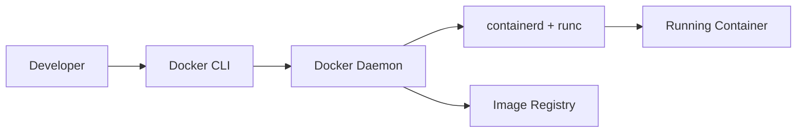

# Docker and CI/CD Foundations

[](../README.md)
[](../README.md)
[](../README.md)

This module focuses on containerization, delivery pipelines, and release engineering from an operational systems perspective. The goal is to understand how build artifacts move into production reliably, how deployments fail, and how automation reduces operational risk.

## Repository Navigation

[](../README.md)
[](../01-linux-networking/README.md)
[](../03-kubernetes-terraform/README.md)

## Table of Contents

- [Module Purpose](#module-purpose)
- [Module Index](#module-index)
- [Production Deployment Perspective](#production-deployment-perspective)
- [Why Containers Changed Infrastructure Engineering](#why-containers-changed-infrastructure-engineering)
- [Why CI/CD Matters Operationally](#why-cicd-matters-operationally)
- [Docker Architecture Basics](#docker-architecture-basics)
- [Image Lifecycle and Supply Chain](#image-lifecycle-and-supply-chain)
- [Volumes and Data Management](#volumes-and-data-management)
- [Networking and Reverse Proxy Integration](#networking-and-reverse-proxy-integration)
- [Multi-stage Builds and Runtime Hardening](#multi-stage-builds-and-runtime-hardening)
- [Deployment Pipelines](#deployment-pipelines)
- [Deployment Engineering Philosophy](#deployment-engineering-philosophy)
- [Health Checks and Deployment Safety](#health-checks-and-deployment-safety)
- [Blue-Green Deployments and Rollback Philosophy](#blue-green-deployments-and-rollback-philosophy)
- [Infrastructure Reproducibility](#infrastructure-reproducibility)
- [Operational Consistency](#operational-consistency)
- [Automation Engineering Principles](#automation-engineering-principles)
- [Learning Roadmap](#learning-roadmap)
- [Experiments](#experiments)
- [Failure Analysis](#failure-analysis)
- [Folder Structure Overview](#folder-structure-overview)
- [Progress Tracking](#progress-tracking)
- [Future Enhancements](#future-enhancements)

## Module Purpose

Containers and CI/CD are the backbone of modern delivery systems. This module focuses on how artifacts are built, validated, and deployed with operational safety in mind. It emphasizes repeatable deployment workflows and failure-resistant release engineering.

## Module Index

This index links to living artifacts as they are published.

| Artifact | Purpose | Status |
| --- | --- | --- |
| [notes.md](notes.md) | Design decisions and operational references | Active |
| [commands.md](commands.md) | Curated commands with context | Active |
| [learnings.md](learnings.md) | Key insights and tradeoffs | Active |
| [mistakes.md](mistakes.md) | Pitfalls and corrections | Active |
| [experiments/](experiments/) | Build and deployment trials | Planned |
| [diagrams/](diagrams/) | Architecture and pipeline visuals | Planned |
| [scripts/](scripts/) | Automation helpers | Planned |

## Production Deployment Perspective

Production deployments are operational events. Success depends on verification, rollback readiness, and clear change visibility. This module treats deployment systems as part of production reliability, not just delivery speed.

## Why Containers Changed Infrastructure Engineering

- They standardize runtime environments across dev, test, and production.
- They make dependency and OS changes explicit and versioned.
- They enable consistent behavior across heterogeneous infrastructure.

## Why CI/CD Matters Operationally

- Automated pipelines reduce manual release risk.
- Repeatable deployments create predictable operational behavior.
- Continuous validation shortens feedback loops and prevents drift.

## Docker Architecture Basics

- Client communicates with the Docker daemon over a local API.
- Container runtime manages namespaces, cgroups, and filesystems.
- Images are layered artifacts, stored in registries.



## Image Lifecycle and Supply Chain

- Build: Dockerfile defines layers and runtime contract.
- Test: Image verification validates runtime behavior.
- Scan: Vulnerabilities and policy checks gate releases.
- Push: Registry becomes the deployment source of truth.
- Deploy: Orchestrator pulls immutable versions.

## Volumes and Data Management

- Separate state from containers for safe upgrades.
- Explicit volume strategies reduce data loss risk.
- Ownership and permission mapping affect runtime stability.

## Networking and Reverse Proxy Integration

- Container networking abstracts service discovery and routing.
- Reverse proxies terminate TLS and provide path-based routing.
- Consistent port mapping reduces operational ambiguity.

## Multi-stage Builds and Runtime Hardening

- Use builder stages to reduce runtime size.
- Minimize attack surface by dropping build dependencies.
- Prefer non-root users and explicit entrypoints.

## Deployment Pipelines


## Deployment Engineering Philosophy

- Every deployment should be explainable and reversible.
- Release steps must be observable and auditable.
- Rollout safety is more important than throughput.

## Health Checks and Deployment Safety

- Readiness and liveness checks prevent bad rollouts.
- Automated verification gates production promotion.
- Fail fast with clear rollback criteria.

## Blue-Green Deployments and Rollback Philosophy

- Keep known-good versions online during validation.
- Shift traffic gradually to reduce blast radius.
- Roll back based on signals, not manual judgment alone.

## Infrastructure Reproducibility

- Treat images as immutable release artifacts.
- Record build metadata and versioned configuration.
- Ensure deployment environments are deterministic.

## Operational Consistency

- Keep pipeline stages consistent across environments.
- Standardize configuration and secrets handling.
- Use consistent health checks and rollout gates.

## Automation Engineering Principles

- Automate the happy path and the rollback path.
- Make pipeline state visible and auditable.
- Keep deployment logic consistent across environments.

## Learning Roadmap

| Phase | Focus | Output |
| --- | --- | --- |
| 1 | Container basics and lifecycle | Image and runtime notes |
| 2 | Docker networking and storage | Experiments and diagrams |
| 3 | CI/CD pipeline fundamentals | Pipeline flow diagrams |
| 4 | Release strategies and rollback | Operational notes |
| 5 | Reliability during deployment | Failure analysis notes |

## Experiments

- Build multi-stage images and compare size and startup time.
- Simulate deployment failures and validate rollback behavior.
- Test reverse proxy routing and TLS termination with containers.
- Validate health checks under load and dependency failures.

## Failure Analysis

- Identify failure points across build, test, and deploy stages.
- Capture root cause and rollback signals in [learnings.md](learnings.md) and [mistakes.md](mistakes.md).
- Track deployment risk by environment and change type.

## Folder Structure Overview

```text
02-docker-cicd/
	README.md
	notes.md
	commands.md
	learnings.md
	mistakes.md
	experiments/
	diagrams/
	scripts/
```

## Progress Tracking

| Area | Status | Evidence |
| --- | --- | --- |
| Container fundamentals | In progress | [notes.md](notes.md) |
| Image lifecycle and supply chain | Planned | [diagrams/](diagrams/) |
| CI/CD pipeline design | Planned | [experiments/](experiments/) |
| Deployment safety patterns | Planned | [learnings.md](learnings.md) |

Progress is reflected in Git history and updates to [notes.md](notes.md), [learnings.md](learnings.md), and [mistakes.md](mistakes.md).

## Future Enhancements

- Add container security posture checks and policy gates.
- Expand release strategies to canary and progressive delivery.
- Include reproducibility checks with build provenance.
- Document failure injection techniques for deployment testing.

