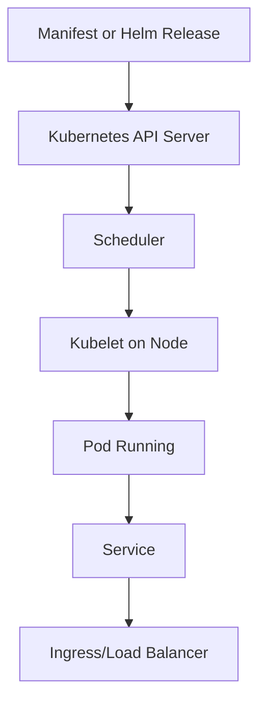
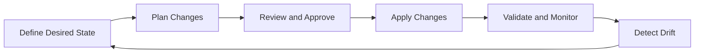

# Kubernetes and Terraform Foundations

[](../README.md)
[](../README.md)
[](../README.md)

This module studies container orchestration and Infrastructure as Code from a systems engineering perspective. The focus is on operational workflows, reliability, and automation across infrastructure lifecycles.

## Repository Navigation

[](../README.md)
[](../02-docker-cicd/README.md)
[](../04-observability-reliability/README.md)

## Table of Contents

- [Module Purpose](#module-purpose)
- [Module Index](#module-index)
- [Why Orchestration Became Necessary](#why-orchestration-became-necessary)
- [Problems Kubernetes Solves](#problems-kubernetes-solves)
- [Declarative Infrastructure Philosophy](#declarative-infrastructure-philosophy)
- [Operational Engineering Perspective](#operational-engineering-perspective)
- [Reliability Engineering Relevance](#reliability-engineering-relevance)
- [Kubernetes Building Blocks](#kubernetes-building-blocks)
- [Kubernetes Operational Workflows](#kubernetes-operational-workflows)
- [Infrastructure Automation with Terraform](#infrastructure-automation-with-terraform)
- [Terraform State Management](#terraform-state-management)
- [Infrastructure Lifecycle Management](#infrastructure-lifecycle-management)
- [Scalability and Reliability Considerations](#scalability-and-reliability-considerations)
- [Learning Roadmap](#learning-roadmap)
- [Infrastructure Maturity Progression](#infrastructure-maturity-progression)
- [Experiment Tracking](#experiment-tracking)
- [GitOps Future Integration](#gitops-future-integration)
- [Folder Structure Overview](#folder-structure-overview)
- [Progress Tracking](#progress-tracking)
- [Future Roadmap](#future-roadmap)

## Module Purpose

Kubernetes and Terraform represent the core of modern infrastructure automation. This module focuses on declarative systems, operational workflows, and infrastructure lifecycle management with reliability as a first-class concern.

## Module Index

This index links to living artifacts as they are published.

| Artifact | Purpose | Status |
| --- | --- | --- |
| [notes.md](notes.md) | Operational summaries and reference patterns | Active |
| [commands.md](commands.md) | Curated commands with context | Active |
| [learnings.md](learnings.md) | Key insights and tradeoffs | Active |
| [mistakes.md](mistakes.md) | Pitfalls and corrections | Active |
| [experiments/](experiments/) | Orchestration and IaC trials | Planned |
| [diagrams/](diagrams/) | Cluster and lifecycle visuals | Planned |
| [manifests/](manifests/) | Kubernetes resource declarations | Planned |
| [terraform/](terraform/) | Infrastructure provisioning code | Planned |
| [scripts/](scripts/) | Automation helpers | Planned |

## Why Orchestration Became Necessary

- Manual scheduling does not scale in distributed environments.
- Service discovery and failover need automated control planes.
- Repeatability requires desired-state management.

## Problems Kubernetes Solves

- Automated scheduling and placement.
- Service discovery and load balancing.
- Self-healing and controlled rollouts.
- Scaling based on demand.

## Declarative Infrastructure Philosophy

- Define desired state and let the system converge.
- Changes are applied as versioned, auditable declarations.
- Operations focus on drift detection and reconciliation.

## Operational Engineering Perspective

- Day-2 operations are as critical as initial provisioning.
- Cluster behavior must be observable and debuggable.
- Changes should be staged, validated, and recoverable.

## Reliability Engineering Relevance

- Orchestration provides controlled recovery from failures.
- Declarative state reduces configuration drift.
- Infrastructure automation enables repeatable reliability practices.

## Kubernetes Building Blocks

| Component | Purpose | Operational relevance |
| --- | --- | --- |
| Pods | Execution unit | Resource isolation and lifecycle control |
| Deployments | Desired state for replicas | Safe rollouts and rollbacks |
| Services | Stable networking identity | Resilience and discovery |
| Ingress | L7 routing and TLS | External traffic control |
| ConfigMaps | Non-secret configuration | Change management |
| Secrets | Sensitive configuration | Access control |
| Autoscaling | Dynamic capacity | Cost and stability balance |
| Helm | Package management | Standardized releases |

## Kubernetes Operational Workflows



## Infrastructure Automation with Terraform

- Codify infrastructure resources and dependencies.
- Apply changes with plan, review, and execute phases.
- Enable repeatable environments across lifecycles.

## Terraform State Management

- Remote state keeps shared infrastructure consistent.
- State locking prevents concurrent corruption.
- Drift detection keeps reality aligned with code.

## Infrastructure Lifecycle Management



## Scalability and Reliability Considerations

- Control plane reliability is as important as workloads.
- Autoscaling requires predictable metrics and safe thresholds.
- IaC changes should be tested and promoted across environments.

## Learning Roadmap

| Phase | Focus | Output |
| --- | --- | --- |
| 1 | Kubernetes primitives and workloads | Notes and workload examples |
| 2 | Networking and ingress | Architecture diagrams |
| 3 | Helm packaging and release flow | Release notes and diagrams |
| 4 | Terraform fundamentals | IaC notes and experiments |
| 5 | Operational workflows | Operational checklists and learnings |

## Infrastructure Maturity Progression

| Level | Characteristics | Evidence |
| --- | --- | --- |
| 1 | Manual provisioning | Scripts and notes |
| 2 | Basic IaC | IaC notes and scripts |
| 3 | Automated rollouts | Release notes and checklists |
| 4 | Reliability controls | SLO-aligned scaling |
| 5 | Continuous reconciliation | Drift detection and GitOps |

## Experiment Tracking

- Deploy a multi-service app and validate service discovery.
- Simulate node failure and observe rescheduling behavior.
- Perform Terraform drift detection and state recovery.
- Compare Helm releases with raw manifests for operational clarity.

## GitOps Future Integration

Future work will explore GitOps tooling to automate cluster reconciliation, ensure auditable deployments, and enforce environment parity.

## Folder Structure Overview

```text
03-kubernetes-terraform/
	README.md
	notes.md
	commands.md
	learnings.md
	mistakes.md
	experiments/
	diagrams/
	manifests/
	terraform/
	scripts/
```

## Progress Tracking

| Area | Status | Evidence |
| --- | --- | --- |
| Kubernetes core primitives | In progress | [notes.md](notes.md) |
| Kubernetes networking | Planned | [diagrams/](diagrams/) |
| Helm packaging | Planned | [experiments/](experiments/) |
| Terraform state management | Planned | [learnings.md](learnings.md) |

Progress is reflected in Git history and updates to [notes.md](notes.md), [learnings.md](learnings.md), and [mistakes.md](mistakes.md).

## Future Roadmap

- Add multi-cluster orchestration experiments.
- Implement policy controls for IaC changes.
- Expand reliability practices with rollout safety checks.
- Introduce GitOps workflows with audit trails.

