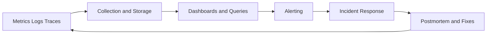

# Observability and Reliability Foundations

[](../README.md)
[](../README.md)
[](../README.md)

This module develops operational visibility and reliability engineering fundamentals. It focuses on how to observe distributed systems, interpret signals, and respond to failures with disciplined operational practice.

## Repository Navigation

[](../README.md)
[](../03-kubernetes-terraform/README.md)

## Table of Contents

- [Module Purpose](#module-purpose)
- [Module Index](#module-index)
- [Why Observability Matters](#why-observability-matters)
- [Monitoring vs Observability](#monitoring-vs-observability)
- [Reliability Engineering Mindset](#reliability-engineering-mindset)
- [Production Operations Perspective](#production-operations-perspective)
- [Core Signals: Metrics, Logs, Traces](#core-signals-metrics-logs-traces)
- [Tooling Stack](#tooling-stack)
- [Alerting Systems](#alerting-systems)
- [SLI and SLO Introduction](#sli-and-slo-introduction)
- [Incident Response Basics](#incident-response-basics)
- [Incident Analysis Philosophy](#incident-analysis-philosophy)
- [Failure Recovery and Rollback](#failure-recovery-and-rollback)
- [Operational Resilience](#operational-resilience)
- [Debugging Mindset](#debugging-mindset)
- [Observability Workflow Diagram](#observability-workflow-diagram)
- [Experiments](#experiments)
- [Folder Structure Overview](#folder-structure-overview)
- [Progress Tracking](#progress-tracking)
- [Future Roadmap](#future-roadmap)

## Module Purpose

Observability and reliability determine whether systems are operable in production. This module develops the ability to detect issues early, reduce incident duration, and understand system behavior under failure conditions.

## Module Index

This index links to living artifacts as they are published.

| Artifact                     | Purpose                             | Status  |
| ---------------------------- | ----------------------------------- | ------- |
| [notes.md](notes.md)         | Operational guidance and references | Active  |
| [commands.md](commands.md)   | Curated queries and commands        | Active  |
| [learnings.md](learnings.md) | Key insights and tradeoffs          | Active  |
| [mistakes.md](mistakes.md)   | Pitfalls and corrections            | Active  |
| [experiments/](experiments/) | Signal validation and drills        | Planned |
| [diagrams/](diagrams/)       | Visibility and workflow diagrams    | Planned |
| [dashboards/](dashboards/)   | Dashboards and panels               | Planned |
| [alerts/](alerts/)           | Alert rules and thresholds          | Planned |
| [runbooks/](runbooks/)       | Incident response guides            | Planned |
| [scripts/](scripts/)         | Analysis helpers                    | Planned |

## Why Observability Matters

- It turns system behavior into evidence for decision-making.
- It reduces mean time to detect and resolve failures.
- It enables capacity planning and reliability improvement.

## Monitoring vs Observability

- Monitoring answers known questions with predefined metrics.
- Observability enables discovery of unknown failure modes.
- Both are required to operate distributed systems safely.

## Reliability Engineering Mindset

- Build systems that degrade predictably under stress.
- Focus on recovery time, not just uptime.
- Use feedback loops to improve reliability over time.

## Production Operations Perspective

- Treat visibility as a production dependency.
- Make incident response roles and communication explicit.
- Balance alert sensitivity with operational load.

## Core Signals: Metrics, Logs, Traces

| Signal  | Purpose                      | Operational value               |
| ------- | ---------------------------- | ------------------------------- |
| Metrics | Quantitative system behavior | SLO tracking and alerting       |
| Logs    | Event context and details    | Root cause evidence             |
| Traces  | Request path visibility      | Latency and dependency analysis |

## Tooling Stack

- Prometheus for metrics collection and alert rules.
- Grafana for visualization and dashboards.
- Loki for log aggregation and query.

## Alerting Systems

- Alerts should be actionable and tied to user impact.
- Alert fatigue is operational debt.
- Severity should map to response playbooks.

## SLI and SLO Introduction

- SLIs measure user-facing reliability.
- SLOs define acceptable reliability boundaries.
- Error budgets create room for change while protecting stability.

## Incident Response Basics

- Detect, assess, mitigate, and recover.
- Communicate clearly and record the timeline.
- Capture root cause and follow-up improvements.

## Incident Analysis Philosophy

- Focus on systems and process gaps, not individual error.
- Tie findings to concrete operational improvements.
- Preserve evidence for future pattern recognition.

## Failure Recovery and Rollback

- Rollback is a first-class operational control.
- Recovery steps must be scripted and tested.
- Post-incident analysis should produce actionable changes.

## Operational Resilience

- Design for partial failure and degraded modes.
- Prioritize critical paths over non-essential features.
- Build visibility into dependencies and third-party services.

## Debugging Mindset

- Prefer evidence over intuition.
- Start with the widest signal, narrow to root cause.
- Validate fixes with clear verification steps.

## Observability Workflow Diagram



## Experiments

- Build dashboards for service latency and error rate.
- Create log-based incident timelines.
- Trace multi-service request paths and identify bottlenecks.
- Simulate alert storms and refine alert rules.

## Folder Structure Overview

```text
04-observability-reliability/
	README.md
	notes.md
	commands.md
	learnings.md
	mistakes.md
	experiments/
	diagrams/
	dashboards/
	alerts/
	runbooks/
	scripts/
```

## Progress Tracking

| Area                           | Status      | Evidence                     |
| ------------------------------ | ----------- | ---------------------------- |
| Metrics and dashboards         | In progress | [notes.md](notes.md)         |
| Logging strategy               | Planned     | [learnings.md](learnings.md) |
| Tracing and dependency mapping | Planned     | [diagrams/](diagrams/)       |
| Incident response workflow     | Planned     | [mistakes.md](mistakes.md)   |

Progress is reflected in Git history and updates to [notes.md](notes.md), [learnings.md](learnings.md), and [mistakes.md](mistakes.md).

## Future Roadmap

- Introduce chaos engineering experiments to validate resilience.
- Expand SLO coverage across service tiers.
- Add automated incident detection and annotation workflows.
- Document rollback engineering patterns and recovery playbooks.
