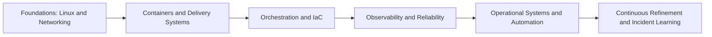
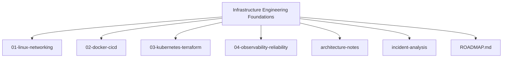

# Infrastructure Engineering Foundations

This repository is a long-term, public infrastructure engineering knowledge system. It documents practical experimentation, operational systems, and reliability-focused learning across Linux, networking, containers, CI/CD, Kubernetes, Terraform, observability, and automation. The goal is depth, not speed.

## Repository Navigation

## Table of Contents

- [Repository Purpose](#repository-purpose)
- [Engineering Philosophy](#engineering-philosophy)
- [Engineering Principles](#engineering-principles)
- [Infrastructure, Automation, Reliability Pillars](#infrastructure-automation-reliability-pillars)
- [Learning Roadmap](#learning-roadmap)
- [Folder Architecture Visualization](#folder-architecture-visualization)
- [Documentation Philosophy](#documentation-philosophy)
- [Documentation System](#documentation-system)
- [Operational Engineering Mindset](#operational-engineering-mindset)
- [Operational Mindset](#operational-mindset)
- [Engineering Consistency](#engineering-consistency)
- [Public Learning Philosophy](#public-learning-philosophy)
- [Progress Tracking](#progress-tracking)
- [Future Scope](#future-scope)
- [Future Roadmap](#future-roadmap)
- [Contribution Philosophy](#contribution-philosophy)

## Repository Purpose

Infrastructure Engineering Foundations is a public, operational engineering lab. It is a place to build depth by working through real infrastructure concepts, systems design, and reliability practices with documentation that remains useful over time. It is not a beginner challenge or a fast-paced roadmap. It is a long-term foundation.

## Engineering Philosophy

- Systems first, tools second.
- Reliability is engineered, not hoped for.
- Documentation is an operational artifact.
- Every learning artifact should be testable or observable.
- Automate repeatable actions, keep manual steps deliberate and reviewed.

## Engineering Principles

- Design for failure, not for perfect operation.
- Prefer boring, well-understood primitives before complex platforms.
- Use explicit interfaces and measurable contracts between systems.
- Treat infrastructure changes as production-grade code.
- Keep feedback loops tight with monitoring and post-incident learning.

## Infrastructure, Automation, Reliability Pillars

| Pillar | Scope | Outcomes |
| --- | --- | --- |
| Infrastructure | Linux, networking, compute, storage, runtime | Predictable, observable infrastructure behavior |
| Automation | CI/CD, IaC, scripting, workflows | Repeatability, safer change velocity |
| Reliability | Observability, SLOs, failure modes | Operational confidence and resilience |

## Learning Roadmap

This roadmap is designed for iterative depth, not linear completion.

## Folder Architecture Visualization

## Documentation Philosophy

- Write for future operational reuse, not for present-day memory.
- Document assumptions, constraints, and decision rationale.
- Prefer short, structured docs that can be scanned during incidents.
- Keep diagrams current with architecture notes and experiments.

## Documentation System

- Each module uses a small set of evolving documents to keep daily updates simple.
- Experiments, diagrams, and scripts live inside modules for locality.
- Cross-module architecture and incident work stay at the repository root.

## Operational Engineering Mindset

- Think in failure modes and recovery paths.
- Practice incident discipline even in experiments.
- Measure before optimizing, automate before scaling.
- Favor predictable, observable systems over cleverness.

## Operational Mindset

- Run changes like deployments: plan, execute, validate, rollback.
- Track operational debt and repay it intentionally.
- Treat experiments as first-class operational systems.
- Keep operational notes close to the systems they describe.

## Engineering Consistency

- Standard folder structure and naming for repeatability.
- Clear separation between experiments, reference notes, and scripts.
- Structured documentation patterns across all topics.
- Explicit scope and outcomes for each learning module.

## Public Learning Philosophy

- Build in public with operational transparency.
- Prefer depth and accuracy over speed and volume.
- Record mistakes and corrections as part of the system.
- Share practical context, not curated highlights.

## Progress Tracking

Progress is tracked through:

- Git commit history as the primary progression timeline.
- Incremental module READMEs with current scope and next steps.
- Experiments that map to documented systems.
- Architecture notes that reflect decisions over time.

## Future Scope

The future scope is intentionally broad and focuses on operational maturity:

- Advanced networking and traffic management patterns
- Multi-cluster and multi-region orchestration
- IaC governance and policy enforcement
- Continuous verification and reliability testing
- Runtime security and compliance automation

## Future Roadmap

Near to long-term roadmap, subject to revision as learning progresses:

- Expand observability into SLOs, error budgets, and service maps
- Build repeatable incident simulations and failure injection
- Formalize a reliability review process for each module
- Develop automation patterns for lifecycle management
- Document operational tradeoffs and cost/reliability balance

## Contribution Philosophy

This is a personal, long-term engineering foundation. Contributions are welcome when they:

- Improve accuracy, clarity, or operational usefulness
- Add references grounded in real infrastructure behavior
- Strengthen the reliability or automation perspective

If you want to contribute, open an issue with context and evidence. Pull requests should be scoped and align with the repository structure.